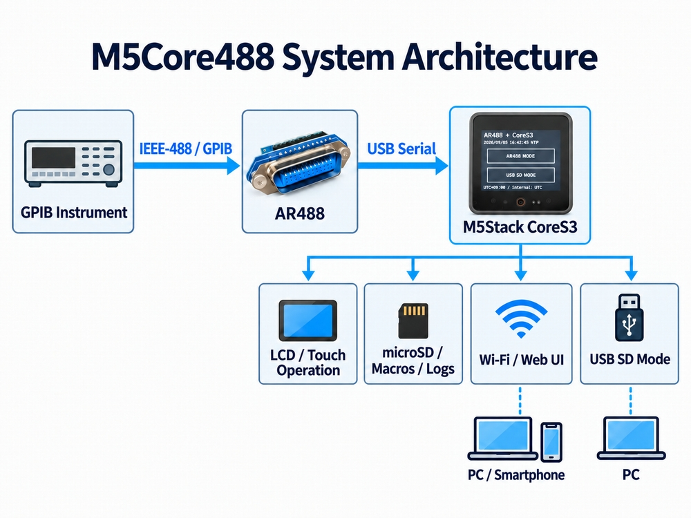

# M5Core488

[日本語](README.ja.md)

**Standalone GPIB Macro Controller & Logger for AR488**

M5Core488 is a small standalone GPIB macro controller built around an AR488 interface and an M5Stack CoreS3.

It keeps AR488 as the GPIB engine and lets the CoreS3 handle macro execution, logging, local touch control, and a simple Web UI.

```text
GPIB Instrument
      |
IEEE-488 / GPIB
      |
    AR488
      |
  USB Serial
      |
M5Stack CoreS3
```

Macros are stored as plain text files on a microSD card.  
Instrument responses can be logged to CSV, and the unit can also be operated from a web browser on the same LAN.


*Basic configuration of M5Core488*

## Features

- Standalone GPIB macro execution from microSD
- Touch-screen macro selection on M5Stack CoreS3
- Web UI for RUN / LOOP / STOP
- `[setup]` and `[loop]` sections
- `@wait` local command
- CSV logging of commands and responses
- NTP / RTC timekeeping
- USB SD Mode for editing microSD files from a PC
- Macro Upload / Download / ON / OFF

## Macro example

Macros are ordinary text files.

```text
[setup]

++addr 22
++auto 0

[loop]

MEAS:VOLT:DC?
++read eoi

@wait 1000
```

`[setup]` runs once when the macro starts.

`[loop]` runs once with **RUN**, or repeatedly with **LOOP** until stopped.

Instrument-specific commands are kept in macro files rather than in the M5Core488 firmware itself.

> `MEAS:VOLT:DC?` above is only a generic SCPI-style DMM example.  
> Actual commands, GPIB addresses, termination settings, and timing depend on the instrument.

## Macro language

The M5Core488 macro format is intentionally simple.  
It is not intended to be a general-purpose scripting language such as Python.

The current macro language does **not** provide:

- `if` / `else`
- `for` / `while`
- variables
- functions
- `goto`

For complex automation, branching, calculations, or data processing, a PC-side solution such as Python may be a better fit.

M5Core488 is intended for the simpler space between manual operation and full PC-based automation.

## Hardware

Typical setup:

- M5Stack CoreS3
- AR488
- GPIB instrument
- microSD card
- USB cable between CoreS3 and AR488
- External power for CoreS3 when required

## Operating modes

### AR488 MODE

The CoreS3 acts as a USB Host and communicates with AR488 over USB Serial.

Macro execution, Web UI operation, and CSV logging are normally performed in this mode.

### USB SD MODE

The CoreS3 exposes the microSD card to a PC as USB Mass Storage.

Because the USB port has a different role in each mode, switching between AR488 MODE and USB SD MODE requires a reboot.

## Web UI

The Web UI can display device and macro status and provides:

- RUN
- LOOP
- STOP AFTER CYCLE
- Macro ON / OFF
- Macro Upload / Download
- CSV Log Download

The current Web UI has no user authentication.  
It is intended for use on a trusted LAN only. Do not expose it directly to the Internet.

## Documentation

- [Japanese User Manual](docs/manual_ja.md)
- [English User Manual](docs/manual_en.md)

## Status

M5Core488 is currently under development and has been tested with real GPIB instruments.

The goal is not to build a universal GPIB automation platform.  
It is simply a convenient way to use existing GPIB instruments without bringing up a PC for every small task.

## Possible future directions

M5Core488 is currently focused on AR488 and GPIB instruments.
However, the macro execution, logging, touch UI, and Web UI layers are not fundamentally limited to GPIB. Since AR488 is handled as a USB serial device, a similar architecture may also be useful for other command-oriented USB serial devices.
One possible future direction is a more generic serial macro controller, where communication parameters such as baud rate, line termination, timeout, and other protocol-related settings could be defined per macro or device profile.
Another possible direction is direct control of USBTMC-compatible instruments, allowing SCPI commands to be sent from the CoreS3 without an AR488 interface.
These are currently only ideas for future experiments. The present M5Core488 implementation remains focused on AR488.

## Third-party projects

M5Core488 interoperates with or uses software from projects including:

- [AR488](https://github.com/Twilight-Logic/AR488)
- M5Unified
- M5GFX
- [EspUsbHost](https://github.com/tanakamasayuki/EspUsbHost)

Each third-party project remains subject to its own license.

## License

M5Core488 source code is released under the [MIT License](LICENSE).
