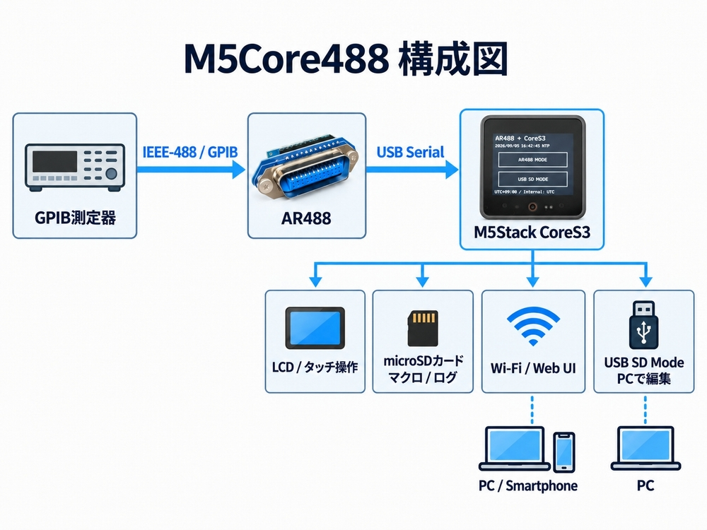
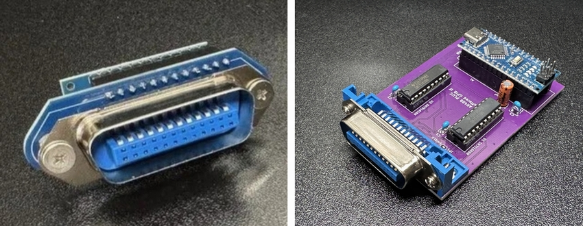
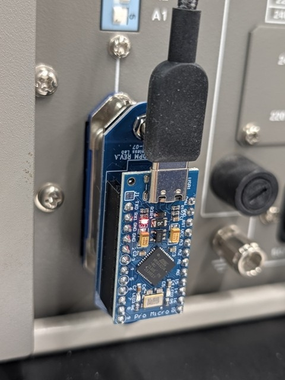
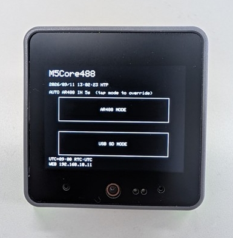
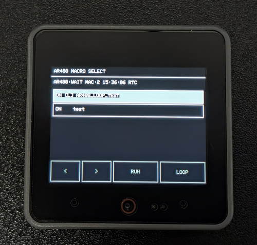
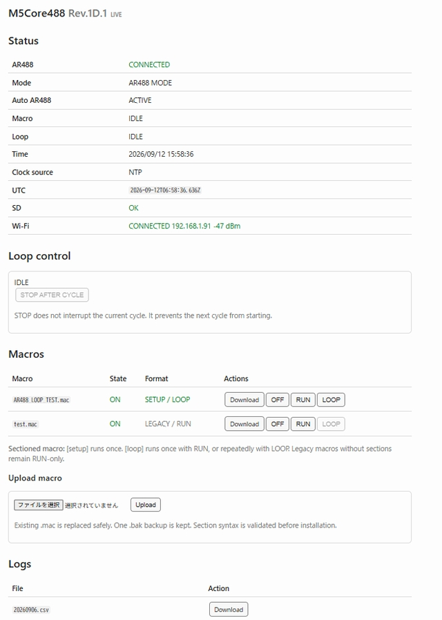
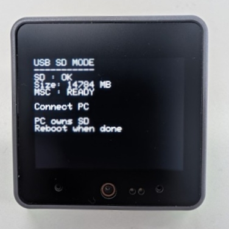

# M5Core488 ユーザーマニュアル
---
## 1. はじめに

M5Core488 は、AR488 を M5Stack CoreS3 から操作するための、PCレス GPIB マクロコントローラです。

AR488 は Arduino 系マイコンを使ったオープンソースの GPIB（IEEE-488）コントローラで、USB シリアル経由で GPIB 測定器へコマンドを送ることができます。

M5Core488 では、AR488 の GPIB 制御機能はそのまま利用し、M5Stack CoreS3 が次の役割を受け持ちます。

- microSD カードからマクロを読み込む
- タッチ画面からマクロを選択・実行する
- Wi-Fi 経由の Web UI からマクロを実行する
- 測定結果や通信内容を CSV 形式で記録する
- NTP を使って時刻を合わせる
- microSD カードを USB ストレージとして PC から編集する

基本構成は次のとおりです。

```text
GPIB測定器
    |
IEEE-488 / GPIB
    |
  AR488
    |
USB Serial
    |
M5Stack CoreS3
    |
    +-- LCD / タッチ操作
    +-- microSD / マクロ / ログ
    +-- Wi-Fi / Web UI
    +-- USB SD Mode
```

*M5Core488 の基本構成*

M5Core488 自体は特定の測定器に依存しません。

測定器固有のコマンドは microSD カード上のマクロファイルへ記述します。

そのため、対応測定器を増やすたびに M5Core488 のファームウェアを書き換える必要はありません。

---

## 2. 必要なもの

### 2.1 ハードウェア

基本的な構成には次のものが必要です。

- M5Stack CoreS3
- AR488
- GPIB 対応測定器
- microSD カード
- AR488 と CoreS3 を接続する USB ケーブル
- 必要に応じて CoreS3 用の外部電源(9V～24V)

### 2.2 AR488

M5Core488 は AR488 を USB シリアル機器として扱います。

現在の実装では、CoreS3 が USB Host となり AR488 と通信します。

通信速度は 115200 bps です。

AR488 のファームウェアや GPIB 側の配線・設定については、AR488 本体の資料を参照してください。



*AR488*



*AR488 GPIB接続例*

---

## 3. microSD カードの構成

M5Core488 は、microSD カード上の次のディレクトリを使用します。

```text
/
├─ macros/
│    ├─ SAMPLE.mac
│    ├─ HP*****.mac
│    └─ ...
│
├─ config/
│    ├─ wifi.ini
│    └─ macros.ini
│
└─ logs/
     ├─ 20260906.csv
     └─ ...
```

### `/macros`

GPIB マクロを保存します。

拡張子は `.mac` です。

### `/config/wifi.ini`

Wi-Fi、NTP、Web UI、起動時動作などを設定します。

### `/config/macros.ini`

各マクロの ON / OFF 状態を保存します。

各マクロの ON / OFF 状態を保存する自動生成ファイルです。
初期状態では存在しない場合があります。ファイルが存在しない場合、すべてのマクロは ON として扱われます。
Web UI でマクロの ON / OFF を変更すると、自動的に作成・更新されます。通常は手作業で編集する必要はありません。

### `/logs`

マクロ実行時の CSV ログが保存されます。

必要なディレクトリが存在しない場合、一部は M5Core488 が自動的に作成します。

---

## 4. 起動

CoreS3 を起動すると、最初にモード選択画面が表示されます。

主な選択肢は次の2つです。

```text
AR488 MODE

USB SD MODE
```



*CoreS3 起動時のモード選択画面*

`wifi.ini` の `auto_ar488_seconds` が 1～60 に設定されている場合、指定時間が経過すると自動的に AR488 MODE へ移行します。

例：

```ini
auto_ar488_seconds=5
```

この場合、起動後約5秒間はモード選択画面を表示し、その間に USB SD MODE を選ばなければ、自動的に AR488 MODE へ入ります。

自動移行を使用しない場合は次のようにします。

```ini
auto_ar488_seconds=0
```

---

## 5. AR488 MODE

AR488 MODE は通常の測定・マクロ実行用モードです。

このモードでは CoreS3 が USB Host となり、AR488 と USB シリアル通信を行います。

AR488 MODE に入ると CoreS3 側の USB 出力が有効になり、AR488 の接続を待ちます。

AR488 が起動時に接続されていなくても、AR488 MODE のまま待機できます。

### 5.1 マクロ一覧

`/macros` ディレクトリにある `.mac` ファイルが一覧表示されます。

マクロファイル名がそのまま表示名になります。

例：

```text
HP*****.mac
RS*****.mac
COUNTER_TEST.mac
```

名称は任意です。

### 5.2 マクロの ON / OFF

マクロごとに有効・無効を設定できます。

OFF にしたマクロは保存されたままですが、RUN や LOOP の対象にはなりません。

状態は `/config/macros.ini` に保存されます。



*AR488-mode screen*

---

## 6. マクロファイル

マクロは通常のテキストファイルです。

基本ルールは次のとおりです。

- 空行は無視される
- `#` で始まる行はコメント
- `@` で始まる行は M5Core488 のローカルコマンド
- その他の行は AR488 へそのまま送信される

例：

```text
# GPIB address
++addr 22

# Instrument command
MEAS:VOLT:DC?

# Read response
++read eoi
```

`MEAS:VOLT:DC?` は SCPI 対応デジタルマルチメータを想定した記述例です。

実際に使用するコマンド、GPIB アドレス、終端条件などは、接続する測定器のプログラミングマニュアルに合わせて変更してください。

### 6.1 マクロ言語について

M5Core488 のマクロは、測定器へコマンドを順番に送るための簡易な記述形式です。

現時点では、Python のような汎用スクリプト言語ではありません。

たとえば次のような構文は実装されていません。

- `if` / `else` などの条件分岐
- `for` / `while` などの繰り返し構文
- 変数
- 関数
- `goto`

連続実行はマクロ内に `for` や `while` を記述するのではなく、M5Core488 側の `[setup]` / `[loop]` と LOOP 実行機能で行います。

---

## 7. `@wait` コマンド

現在実装されている M5Core488 ローカルコマンドは `@wait` です。

書式：

```text
@wait <milliseconds>
```

例：

```text
@wait 500
```

この場合、500 ms 待ってから次の行へ進みます。

最大値は 600000 ms です。

```text
@wait 600000
```

は10分待機を意味します。

数値以外の文字が含まれている場合や、最大値を超えた場合はエラーになります。

---

## 8. `[setup]` と `[loop]`

連続測定では、測定器の初期設定と繰り返し測定部分を分けて記述できます。

例：

```text
[setup]

++addr 3
++auto 0

# 必要に応じて測定器の初期設定を記述

[loop]

MEAS:FREQ?
++read eoi

@wait 1000
```

上の例は、SCPI 対応周波数カウンタを想定した簡単な記述例です。

実際のコマンド体系は測定器によって異なります。

### `[setup]`

マクロ開始時に1回だけ実行されます。

測定モード、レンジ、トリガ、入力条件など、毎回送り直す必要のない設定に向いています。

### `[loop]`

RUN の場合は1回だけ実行されます。

LOOP の場合は停止するまで繰り返し実行されます。

### 実行イメージ

RUN：

```text
[setup]
   |
   v
[loop] x 1
   |
   v
終了
```

LOOP：

```text
[setup] x 1
   |
   v
[loop] cycle 1
   |
[loop] cycle 2
   |
[loop] cycle 3
   |
   ...
```

### 注意

`[setup]` と `[loop]` を使用する場合、実行コマンドは各セクションの中へ記述してください。

セクション形式を使用しているのに、セクション外へ実行コマンドを記述するとマクロフォーマットエラーになります。

`[setup]` は `[loop]` より前に記述します。

空の `[loop]` は使用できません。

---

## 9. 従来形式のマクロ

`[setup]` / `[loop]` を使用しない従来形式も使用できます。

例：

```text
++addr 3
++auto 0
MEAS:FREQ?
++read eoi
```

この形式では、RUN を押すとファイル全体を1回実行します。

従来形式のマクロは LOOP 実行できません。

これは、初期化コマンドや設定コマンドまで意図せず繰り返すことを防ぐためです。

---

## 10. RUN

RUN はマクロを1回実行します。

セクション形式の場合は、

```text
[setup] x 1
[loop]  x 1
```

の順で実行します。

従来形式の場合はファイル全体を1回実行します。

実行後、CoreS3 画面には完了状態とログ保存状態が表示されます。

ローカル画面から実行した場合は、画面をタップするとマクロ一覧へ戻ります。

---

## 11. LOOP

LOOP は `[loop]` セクションを繰り返し実行します。

LOOP 開始時には `[setup]` が1回だけ実行されます。

その後、`[loop]` が cycle 1、cycle 2、cycle 3 ... と繰り返されます。

### 11.1 STOP

LOOP は途中で停止できます。

STOP は現在実行中の cycle を強制的に中断しません。

現在の cycle が最後まで完了した後、次の cycle を開始せず停止します。

```text
cycle 12 実行中
       |
     STOP
       |
cycle 12 完了
       |
次の cycle は開始しない
       |
      STOP
```

測定器制御の途中で通信を切らないための動作です。

### 11.2 AR488 が切断された場合

LOOP 中に AR488 の接続が失われた場合、LOOP は ABORT します。

AR488 が再接続されても、自動的には測定を再開しません。

測定器の状態が不明なまま処理を再開しないためです。

再開する場合は、あらためて LOOP を開始してください。

その際 `[setup]` から再実行されます。

---

## 12. Web UI

`wifi.ini` で Web UI を有効にすると、同じ LAN 上の PC やスマートフォンから M5Core488 を操作できます。

設定例：

```ini
web_enable=1
web_port=80
hostname=m5core488
```

通常は次のようなアドレスでアクセスできます。

```text
http://m5core488.local/
```

mDNS が利用できない環境では、IP アドレスを使用してください。



*M5Core488 Web UI*

### 12.1 Status

Web UI では次の状態を確認できます。

- AR488 接続状態
- 現在のモード
- Auto AR488 の状態
- マクロ実行状態
- LOOP 状態と cycle 番号
- ローカル表示時刻
- Clock source
- UTC 時刻
- microSD 状態
- Wi-Fi 接続状態
- IP アドレス
- RSSI

Web の状態表示は約1秒間隔で更新されます。

### 12.2 Macro 操作

Web UI では次の操作ができます。

- Macro Download
- Macro ON / OFF
- RUN
- LOOP
- STOP AFTER CYCLE
- Macro Upload

マクロ実行中は、競合を避けるため一部の操作がロックされます。

### 12.3 Macro Upload

Web UI から `.mac` ファイルをアップロードできます。

アップロード時にはマクロ構文が確認されます。

同名ファイルが存在する場合は置き換えられ、1世代の `.bak` バックアップが保存されます。

---

## 13. Web UI の利用範囲

現在の Web UI にはユーザー認証機能がありません。

そのため、M5Core488 は信頼できる LAN 内での使用を想定しています。

インターネットへ直接公開したり、ルーターでポートフォワーディングして外部へ公開する使い方は推奨しません。

遠隔地から使用する場合も、VPN 等によって信頼できるネットワークを構成したうえで使用してください。

---

## 14. Wi-Fi / NTP 設定

Wi-Fi と時刻関連の設定は `/config/wifi.ini` に記述します。

例：

```ini
# M5Core488 Network / Time / Web configuration

ssid=YOUR_WIFI_SSID
password=YOUR_WIFI_PASSWORD

timezone=UTC+09:00

ntp1=pool.ntp.org
ntp2=time.google.com
ntp3=time.cloudflare.com

ntp_resync_hours=24

web_enable=1
web_port=80
hostname=m5core488

auto_ar488_seconds=5
```

---

## 15. 時刻の扱い

M5Core488 では内部時刻と表示時刻を分けて扱います。

基本方針は次のとおりです。

```text
NTP
 |
 v
UTC
 |
 +-- CoreS3 system clock
 |
 +-- CoreS3 RTC
 |
 +-- CSV log
 |
 +-- LCD / Web 表示時に timezone オフセットを加算
```

RTC は UTC として保持します。

CSV ログも UTC で記録します。

LCD や Web UI では `timezone` の固定オフセットを加えて表示します。

例：

```ini
timezone=UTC+09:00
```

この設定では、日本標準時相当の UTC+09:00 で表示されます。

現在の `timezone` 設定は固定 UTC オフセット方式です。

夏時間（DST）の自動切替には対応していません。

---

## 16. NTP 再同期

`ntp_resync_hours` で NTP 再同期間隔を設定します。

例：

```ini
ntp_resync_hours=24
```

24時間ごとに再同期を試みます。

```ini
ntp_resync_hours=0
```

の場合は起動時のみ NTP 同期を行います。

設定可能な最大値は 720 時間です。

Web UI を有効にしている場合、Wi-Fi が一時的に切断されても再接続を試みます。

GPIB 通信中のタイミングを乱さないため、マクロ実行中には Wi-Fi 再接続処理を行わず、比較的安全なタイミングで処理します。

---

## 17. CSV Logger

マクロ実行時の通信内容は CSV 形式で microSD カードへ保存されます。

ファイル名は UTC 日付を使用します。

例：

```text
/logs/20260906.csv
```

CSV の列は次のとおりです。

```csv
timestamp_utc,clock_source,macro,line,event,command,response
```

### 17.1 `timestamp_utc`

UTC の時刻です。

ミリ秒まで記録します。

例：

```text
2026-09-06T18:26:46.990Z
```

### 17.2 `clock_source`

時刻の取得元です。

主に次の状態があります。

```text
NTP
RTC
UNSYNCED
```

### 17.3 `macro`

実行したマクロ名です。

### 17.4 `line`

マクロファイル上の行番号です。

### 17.5 `event`

実行内容を表します。

代表的なイベント：

```text
START
SETUP_START
SETUP_END
CYCLE_START
CYCLE_END
AR488
LOCAL
ERROR
LOOP_STOP
END
ABORT
```

### 17.6 `command`

AR488 へ送信したコマンド、または M5Core488 のローカルコマンドです。

### 17.7 `response`

AR488 または測定器から返された応答です。

改行を含む応答は CSV 内で扱いやすい形に変換されます。

---

## 18. Logger のエラー

ログファイルを開けない場合や書き込みエラーが発生した場合でも、原則として GPIB マクロ自体は継続します。

```text
ログ保存失敗
     |
測定処理は継続
```

測定そのものをログ書き込み失敗で中断しないためです。

ただし、測定終了後にはログエラーが画面に表示されます。

重要な測定では、実行後に CSV が正しく保存されていることを確認してください。

---

## 19. USB SD MODE

USB SD MODE では、CoreS3 内の microSD カードを PC から USB ストレージとして扱えます。

主な用途は次のとおりです。

- マクロファイルの編集
- `wifi.ini` の編集
- CSV ログのコピー
- microSD カード内ファイルの管理

USB SD MODE に入ると、CoreS3 の USB Host 出力は停止します。

その後、microSD カードを USB Mass Storage として PC へ公開します。

画面には概ね次の状態が表示されます。

```text
USB SD MODE

SD  : OK
MSC : READY

Connect PC

PC owns SD
Reboot when done
```


*usb-sd-mode screen*

### 19.1 重要：microSD の所有権

USB SD MODE 中は、PC が microSD カードを直接操作します。

この間、M5Core488 側から microSD のファイルシステムへ通常アクセスしない設計になっています。

PC と CoreS3 が同時にファイルシステムを書き換えると、microSD の破損につながるためです。

### 19.2 USB SD MODE の終了

USB SD MODE を終了する場合は、次の手順を推奨します。

1. PC 側でドライブの書き込みが終わっていることを確認する
2. Windows 等で安全な取り外しを行う
3. USB 接続を外す
4. CoreS3 を再起動する

モードは動的に切り替えず、再起動によって切り替えます。

---

## 20. USB 接続に関する注意

CoreS3 の USB は、AR488 MODE と USB SD MODE で役割が異なります。

### AR488 MODE

```text
CoreS3 = USB Host
AR488  = USB Device
```

### USB SD MODE

```text
CoreS3 = USB Device
PC     = USB Host
```

同じ USB ポートを両方の役割で同時に使用することはできません。

また、AR488 MODE では CoreS3 側から USB 5V を出力します。

USB 配線や外部電源の構成によっては電源同士が競合する可能性があるため、PC、CoreS3、AR488 を同時に接続する場合は電源経路に注意してください。

ファームウェアを書き込む場合は、AR488 をいったん外してから行うことを推奨します。

---

## 21. Web UI を使わない場合

Web UI が不要な場合は、

```ini
web_enable=0
```

とします。

この場合、起動時の NTP 同期に Wi-Fi を使用した後、Wi-Fi を停止します。

Web Server も起動しません。

---

## 22. サンプルマクロ

### 22.1 AR488 単体 LOOP テスト

GPIB 測定器を接続せず、AR488 単体で LOOP 動作を確認する例です。

```text
# M5Core488 sectioned macro test
# No GPIB instrument is required.

[setup]

++mode 1
++auto 0

@wait 500

[loop]

++ver

@wait 1000
```

LOOP を開始すると、`++ver` が繰り返し実行されます。

最初の動作確認用として使用できます。

### 22.2 SCPI 対応 DMM の記述例

次は、SCPI 対応デジタルマルチメータで直流電圧を繰り返し取得する場合の簡単な記述例です。

```text
[setup]

++addr 22
++auto 0

[loop]

MEAS:VOLT:DC?
++read eoi

@wait 1000
```

### 22.3 SCPI 対応周波数カウンタの記述例

次は、SCPI 対応周波数カウンタで周波数を繰り返し取得する場合の簡単な記述例です。

```text
[setup]

++addr 3
++auto 0

[loop]

MEAS:FREQ?
++read eoi

@wait 1000
```

これらはマクロ形式を説明するための一般的な例です。

実際の SCPI コマンド、GPIB アドレス、入力チャンネル指定、トリガ条件などは、使用する測定器のプログラミングマニュアルに合わせてください。

---

## 23. トラブルシューティング

### AR488 が CONNECTED にならない

確認項目：

- AR488 に正しいファームウェアが書き込まれているか
- USB ケーブルがデータ通信対応か
- AR488 MODE になっているか
- AR488 の USB シリアル速度が想定と一致しているか
- CoreS3 の USB Host が正常に開始しているか

AR488 は起動後に接続しても認識できます。

### マクロが一覧に出ない

確認項目：

- `/macros` ディレクトリに保存されているか
- 拡張子が `.mac` になっているか
- ファイル名が正しいか
- microSD が正常に認識されているか

### LOOP ボタンが使えない

LOOP は `[loop]` セクションを持つ有効なマクロでのみ使用できます。

従来形式のマクロは RUN 専用です。

例：

```text
[setup]
...

[loop]
...
```

の形式になっているか確認してください。

### Macro Format Error になる

主な原因：

- `[setup]` が複数ある
- `[loop]` が複数ある
- `[setup]` より前に `[loop]` がある
- セクション形式なのにコマンドがセクション外にある
- `[loop]` の中に実行行がない

### Web UI が開かない

確認項目：

- `web_enable=1` か
- SSID / Password が正しいか
- CoreS3 が Wi-Fi に接続されているか
- PC / Smartphone が同じネットワークにいるか
- `http://m5core488.local/` が名前解決できるか
- 名前解決できない場合は IP アドレスでアクセスできるか

### 時刻が NTP にならない

確認項目：

- Wi-Fi が接続できているか
- NTP サーバーへ到達できるネットワークか
- `wifi.ini` の NTP サーバー名が正しいか

NTP に同期できない場合でも、RTC の値が有効なら RTC を使用します。

### ログが保存されない

確認項目：

- microSD が正常に認識されているか
- `/logs` が作成できる状態か
- microSD の空き容量
- microSD の書き込み禁止やファイルシステム異常

ログ保存に失敗してもマクロが継続する場合があります。

画面上の `LOG : WRITE ERROR` なども確認してください。

---

## 24. 現在の制限事項

Rev.1D.1 時点では、現在のところ次のような制限があります。

- マクロ言語は簡易なもの
- `if` / `else` などの条件分岐は未実装
- `for` / `while` などの繰り返し構文は未実装
- 変数は未実装
- 関数は未実装
- `goto` は未実装
- マクロ内独自ループ構文はない
- ローカルコマンドは基本的に `@wait` のみ
- Web UI にユーザー認証はない
- `timezone` は固定 UTC オフセット方式
- USB Host と USB SD Mode は同時使用できない
- LOOP の再開は自動では行わない

これらは、意図的に単純な構成を保つための部分もあります。

複雑な条件分岐や繰り返し、測定結果を使った演算などが必要な場合は、PC 上の Python 等を使用した方が適している場合があります。

M5Core488 は、測定器へコマンドを順番に送り、必要に応じて一定周期で繰り返し、結果を記録する程度の用途を主な対象としています。

---

## 25. 動作確認環境

Rev.1D.1 の開発・動作確認で使用した主な環境：

```text
Board:
  M5Stack CoreS3

Arduino FQBN:
  m5stack:esp32:m5stack_cores3

M5Stack ESP32 platform:
  3.3.9

M5Unified:
  0.2.21

M5GFX:
  0.2.28

EspUsbHost:
  2.7.9
```

AR488：

```text
AR488 GPIB controller
ver. 0.53.46
22/05/2026
```

---

## 26. 運用上の考え方

M5Core488 は、汎用的な GPIB コントローラとしてすべての測定器を自動認識するものではありません。

M5Core488 が担当するのは、

```text
マクロを読む
    |
コマンドを送る
    |
応答を受ける
    |
ログを残す
```

という部分です。

どのコマンドを送り、どの順番で設定し、どの値を読み出すかはマクロ側で決めます。

そのため、同じ M5Core488 本体を使用しながら、測定器ごとの `.mac` ファイルを用意して運用できます。

---

## 27. 変更・拡張について

マクロで対応できる範囲であれば、測定器を追加しても M5Core488 のファームウェア変更は不要です。

例：

```text
/macros/
  HP*****.mac
  RS*****.mac
  COUNTER.mac
  DMM.mac
```

M5Core488 本体には測定器固有の処理を極力入れず、測定器固有部分を microSD 側へ分離するのが基本方針です。

---

## 28. おわりに

M5Core488 は、古い GPIB 測定器を PC なしでも扱いやすくするための、小さなコントローラです。

測定器そのものを新しくするわけではありません。

AR488 と CoreS3 に少しずつ仕事を分担してもらい、

```text
電源を入れる
   |
マクロを選ぶ
   |
RUN
```

くらいの手軽さで使えることを目標にしています。

複雑な自動測定には PC と Python が向いています。

M5Core488 は、その少し手前くらいを担当します。


---
